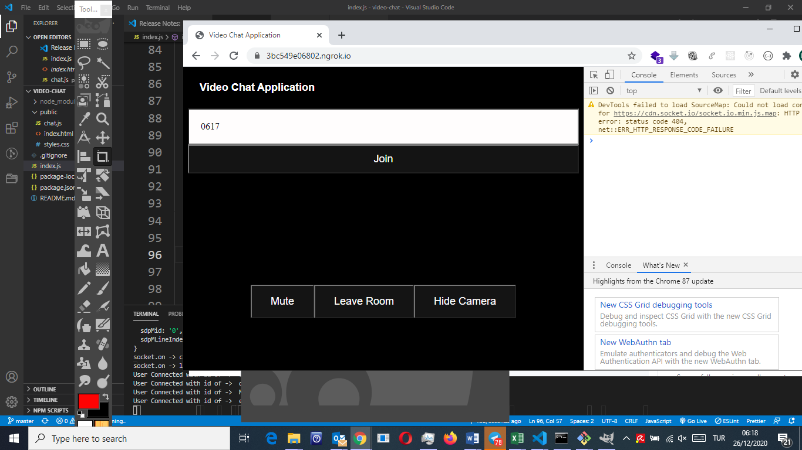
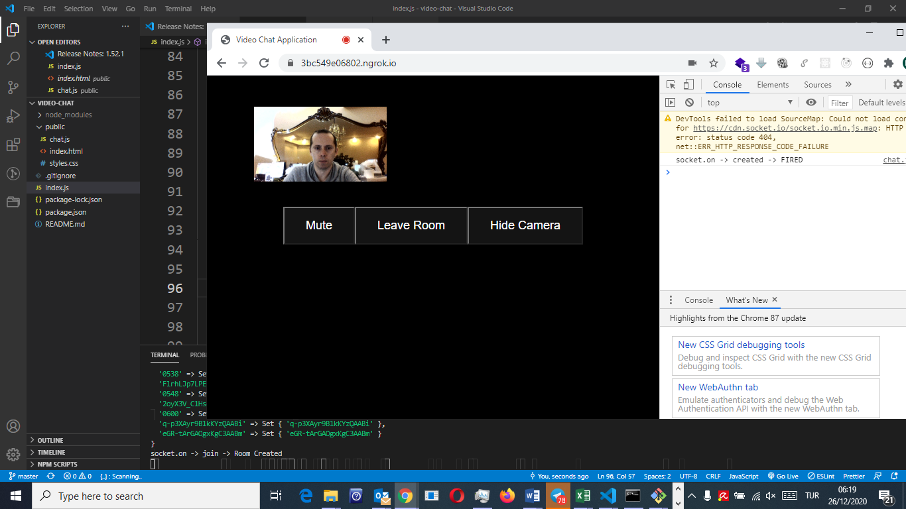
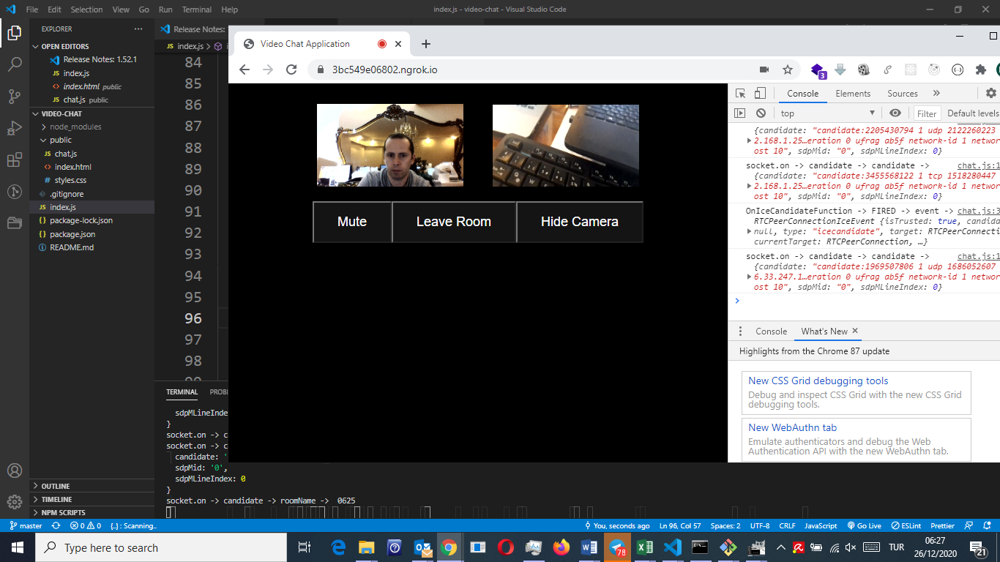
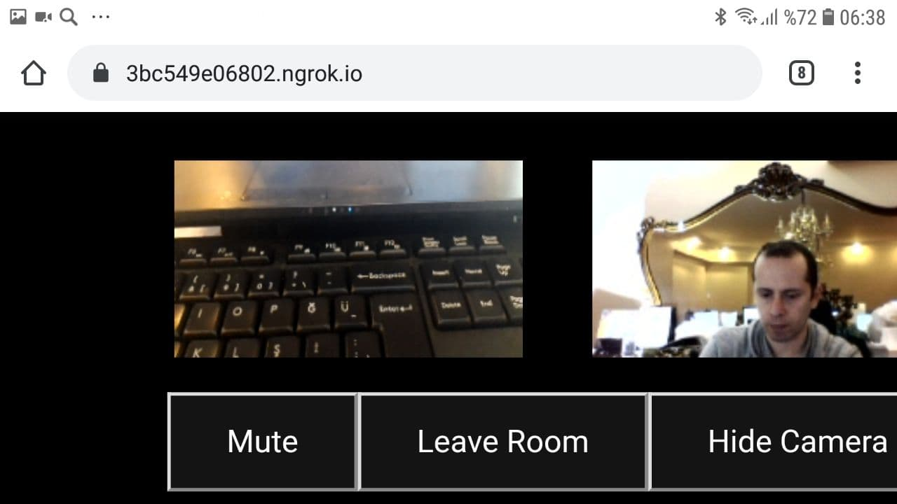

# Video Chat App

## To Run ->

- on Terminal write command
```
node index.js
```

- then copy the created url on terminal inside repoRoot/public/chat.js and change the code on Line 2 as:
```
let socket = io.connect('NGROK URL THAT YOU COPY FROM TERMINAL');
```

- Open browser and go to that NGROK URL

- NOTE: I think there is a problem with Safari & Firefox. However, It works with Chrome.
- NOTE2: Since there is not TURN Server, it may sometimes not work. For details, open google and search STUN Server & TURN Server


## Some Screenshots









## Screenshot From Mobile Phone (Android)


